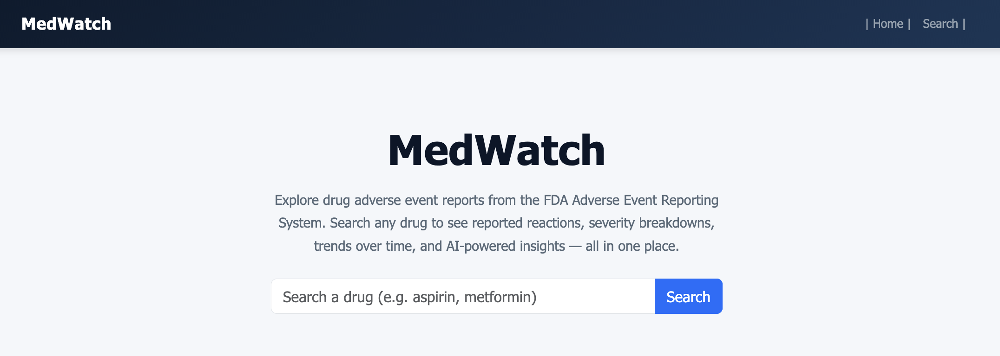
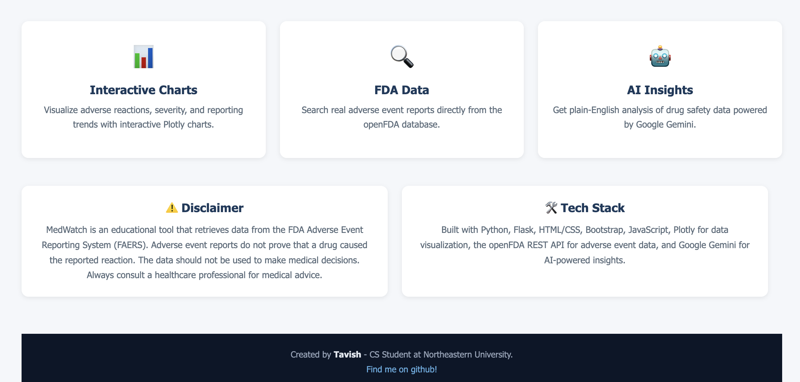
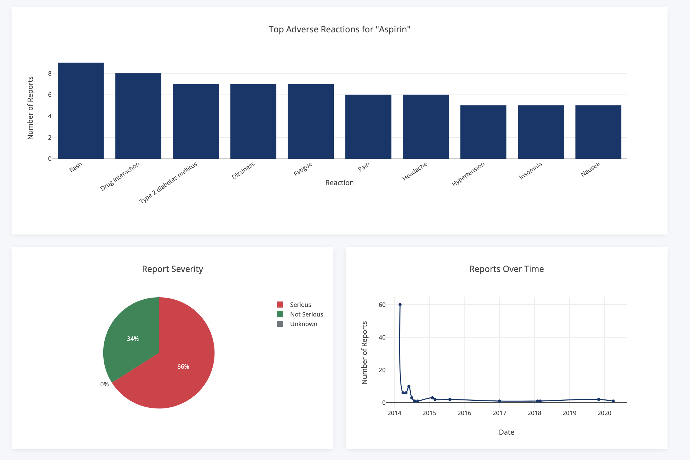
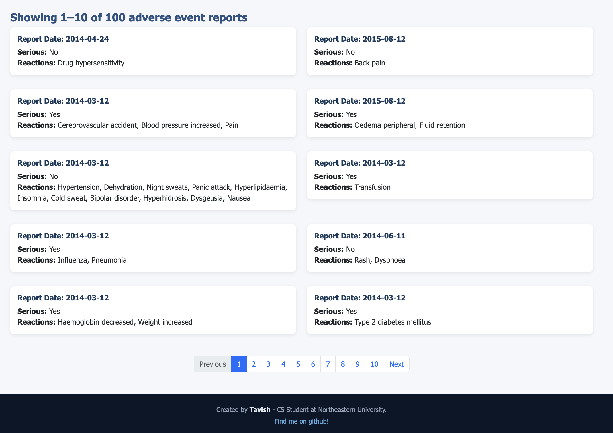
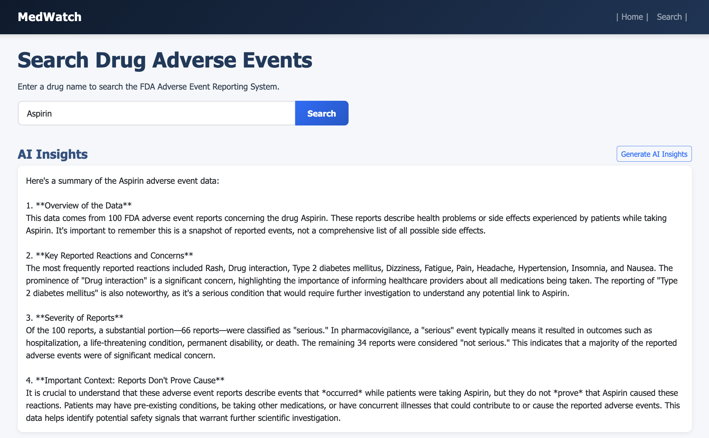

# MedWatch

A full-stack web application that lets you explore drug adverse event reports from the **FDA Adverse Event Reporting System (FAERS)**. Search any drug to see reported reactions, severity breakdowns, trends over time, and AI-powered insights.


## Screenshots

### Homepage




### Search Results & Charts




### AI Insights


## Features

- **Drug Search** — Search any drug name to retrieve up to 100 adverse event reports from the openFDA API
- **Interactive Charts** — Bar chart of top reactions, pie chart of report severity, and a timeline of reports over time (powered by Plotly)
- **AI Insights** — Generate a plain-English analysis of the adverse event data using Google Gemini
- **Paginated Results** — Browse individual adverse event report cards, 10 at a time
- **Responsive Design** — Clean UI built with Bootstrap that works on desktop and mobile

## Tech Stack

- **Backend:** Python, Flask
- **Frontend:** HTML, CSS, JavaScript, Bootstrap 5
- **Data Visualization:** Plotly
- **Data Source:** openFDA Adverse Event Reporting System REST API
- **AI:** Google Gemini 2.5 Flash

## Project Structure

```
medwatch/
├── app.py                  # Flask application and API routes
├── .env                    # API keys (not tracked by git)
├── .gitignore
├── requirements.txt
├── templates/
│   ├── base.html           # Base layout with navbar and footer
│   ├── index.html          # Homepage with hero search
│   └── search.html         # Search page with charts and results
└── static/
    └── css/
        └── style.css       # Custom styles
```

## Getting Started

### Prerequisites

- Python 3.x
- A Google Gemini API key ([get one here](https://aistudio.google.com/apikey))

### Installation

1. **Clone the repository**
   ```bash
   git clone https://github.com/tavishh/medwatch.git
   cd medwatch
   ```

2. **Create and activate a virtual environment**
   ```bash
   python3 -m venv venv
   source venv/bin/activate
   ```

3. **Install dependencies**
   ```bash
   pip install -r requirements.txt
   ```

4. **Set up your environment variables**

   Create a `.env` file in the project root:
   ```
   GEMINI_API_KEY=your-api-key-here
   ```

5. **Run the app**
   ```bash
   python3 app.py
   ```

6. **Open in your browser**
   ```
   http://127.0.0.1:5000
   ```

## How It Works

1. User enters a drug name on the homepage or search page
2. Flask backend queries the openFDA API for adverse event reports
3. Data is processed: reactions are counted, severity is categorized, dates are grouped by month
4. Frontend renders three interactive Plotly charts and paginated report cards
5. User can optionally generate AI insights via Google Gemini for a plain-English summary

## Disclaimer

MedWatch is an educational tool. Adverse event reports do not prove that a drug caused the reported reaction. This data should not be used to make medical decisions. Always consult a healthcare professional for medical advice.

## Author

**Tavish Hookoom**
CS Student at Northeastern University
[github.com/tavishh](https://github.com/tavishh)
